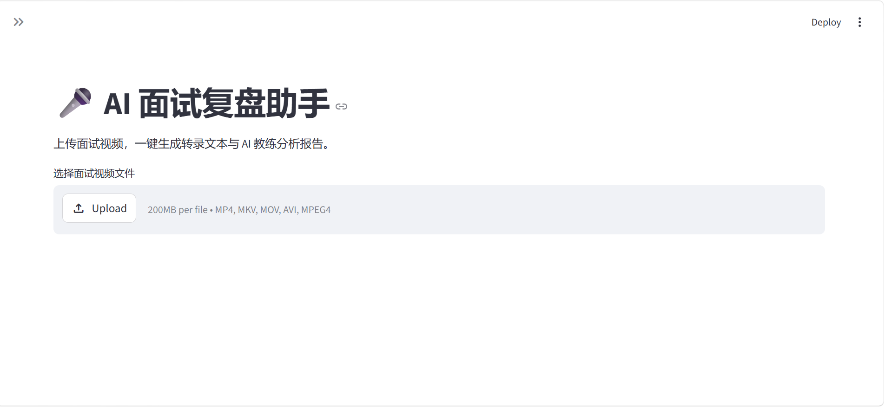
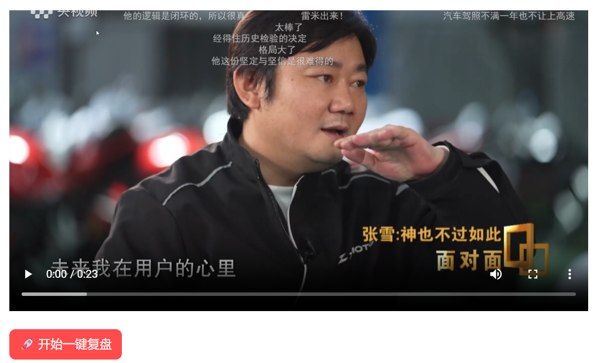
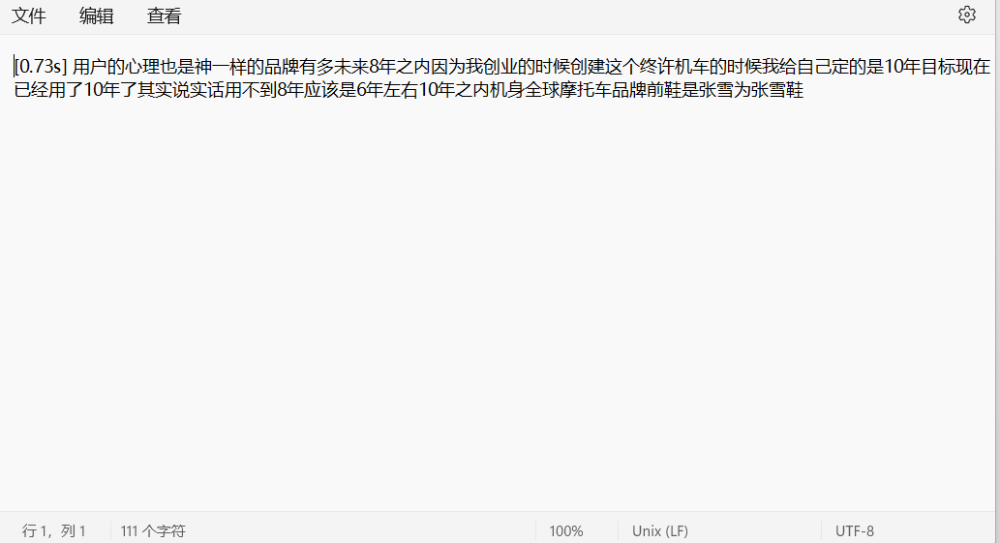
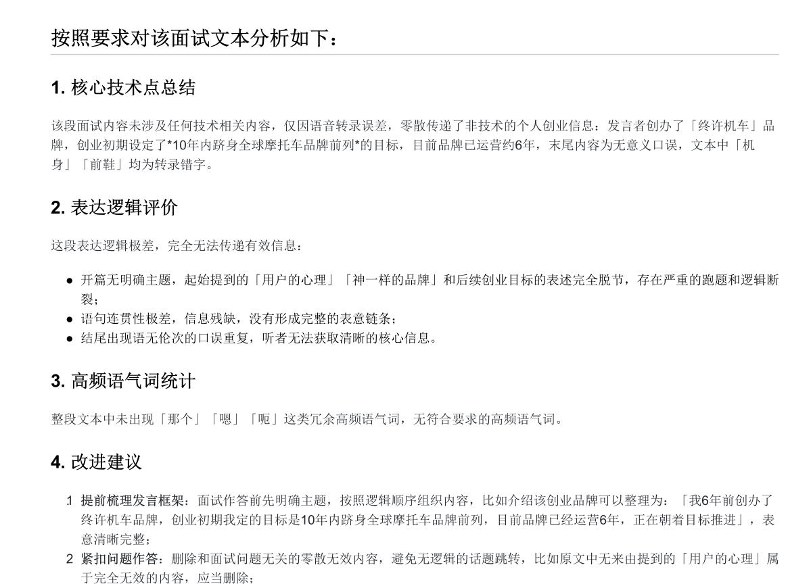

# 🎤 AI Interview Coach (AI 面试复盘助手)

[](https://www.python.org/)
[](LICENSE)
[](https://www.volcengine.com/)

> **将面试视频转化为深度的复盘报告，助你通过每一场技术大厂面试。**

本项目是一款基于 **WhisperX** 与 **豆包 AI (Doubao-Seed-2.0)** 开发的全自动化面试复盘工具。它能精准转录面试内容，并通过 AI 深度诊断你的表达逻辑、技术覆盖面及沟通习惯。

---

## ✨ 核心特性

* **⚡ 高精度转录**：集成 `WhisperX` 框架，提供比标准 Whisper 更准的时间戳对齐。
* **🇨🇳 原生简体中文**：内置 `OpenCC` 转换引擎，消除 AI 模型常见的简繁混杂问题。
* **🤖 豆包 AI 教练**：针对转录内容进行深度分析，自动生成复盘总结：
* **技术关键词提取**：自动识别面试中涉及的核心技术点。
* **表达逻辑诊断**：分析回答是否条理清晰、简洁有力。
* **无效语气词统计**：精准识别“那个、然后、额”等口头禅。
* **针对性改进建议**：提供面试官视角的专业反馈。
* **📂 结构化报告**：一键生成精美的 `Markdown` 格式报告，方便查阅与归档。
* **🛡️ 安全隐私**：通过 `.env` 环境变量管理 API 密钥，确保本地凭证不外泄。
* **🖥️ 极简 GUI**：支持 `Streamlit` 网页交互，拖拽即可使用。

---

## 🚀 快速开始

1. **克隆仓库**: `git clone https://github.com/wyttao120/AI-Interview-Coach.git`
2. **安装依赖**: `pip install -r requirements.txt`
3. **配置环境**: 将 `.env.example` 改名为 `.env` 并填入你的 Ark API Key。
4. **启动应用**: `streamlit run app.py`

---

## 🛠️ 技术栈

| 组件 | 技术实现 |
| :--- | :--- |
| **音频转录** | WhisperX (Tiny/Base) |
| **繁简转换** | OpenCC (Traditional to Simplified) |
| **AI 分析** | 豆包 Doubao-Seed-2.0-lite (火山引擎) |
| **界面展示** | Streamlit |
| **环境配置** | Python-Dotenv |

---

## 🚀 快速上手

### 1. 安装环境与依赖
确保系统中已安装 **FFmpeg**，然后执行以下命令：

```bash
# 克隆仓库
git clone https://github.com/wyttao120/video-interview-transcriber.git
cd interview-coach

# 安装核心依赖
pip install -r requirements.txt
``` 


### 2. 配置 API 密钥
本项目使用环境变量管理敏感信息。请在项目根目录创建 `.env` 文件：

```bash
# 填写以下内容
VOLC_API_KEY=你的火山引擎API密钥
DOUBAO_ENDPOINT_ID=你的豆包接入点ID (EP-ID)
``` 

---

### 3. 运行程序
你可以选择适合你的运行模式：

```bash
方式 A：专业命令行模式
	
	python run_interview.py

方式 B：直观 GUI 模式

	streamlit run app.py
```

## 📺 视觉预览 (Visual Showcase)

### 1. 极简交互入口
> **用户通过直观的 Streamlit 界面上传面试视频，支持 MP4、MKV、MOV 等主流格式。**
<p align="center">
  
</p>

---

### 2. 智能化处理流程 (Agent Workflow)
> **Agent 自动提取音轨并调用 WhisperX 引擎进行高精度对齐，用户可实时预览转录状态。**
<p align="center">
  
</p>

---

### 3. 多维度结果产出 (Analysis & Insights)
| 📝 原始转录文本 (带时间戳) | 🤖 AI 教练深度复盘报告 |
| :---: | :---: |
|  |  |
| **底层实力**：精准捕捉每一秒对话 | **Agent 智能**：提供逻辑诊断与改进建议 |
## 🛡️ 项目安全
* **敏感信息保护**：项目已配置 .gitignore，自动忽略 .env 及所有临时视频文件，防止密钥及面试隐私泄露。

* **本地处理**：语音识别在本地 CPU/GPU 完成，仅脱敏文本传输至 AI 接口。

## 🤝 贡献与支持
欢迎提交 Issue 或 Pull Request 来完善本项目。如果你觉得这个工具有用，请给个 Star ⭐！

## 📄 开源协议
本项目采用 MIT License 许可。
